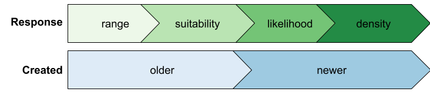

-   `sdm-response-hierarchy.png`\
    {width="600"}\
    [edit in Google Drawing](https://docs.google.com/drawings/d/1pZAKvaGXDR3Wgh6f4b36qlmUewF9IzXxeOR80-zxTeY/edit) (ColorBrewer: [greens](https://colorbrewer2.org/#type=sequential&scheme=Greens&n=4), [blues](https://colorbrewer2.org/#type=sequential&scheme=Blues&n=3))

-   
